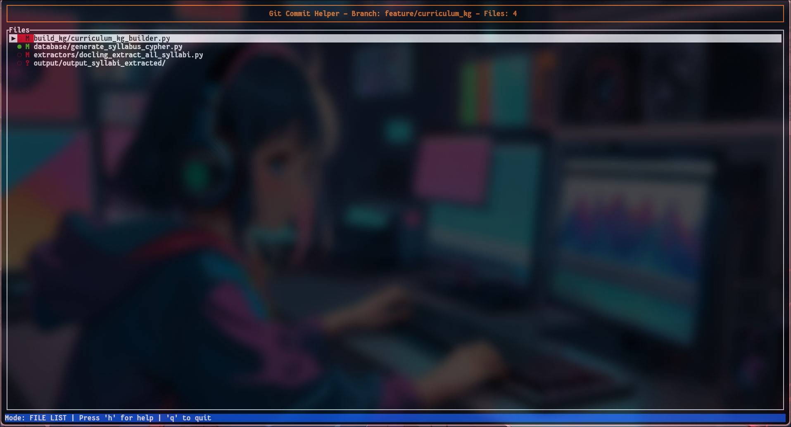

# Git Commit Helper (GCH)

A fast, intuitive terminal-based user interface for managing Git commits. Never struggle with complex Git commands again – stage files, review diffs, write commits, and push changes all from one beautiful interface.



## 🚀 Features

- **📁 Smart File Management** - View all changed files with clear status indicators
- **👀 Built-in Diff Viewer** - Review changes without leaving the interface  
- **✍️ Guided Commit Messages** - Pre-defined prefixes and character count validation
- **🔄 One-Click Operations** - Stage, commit, and push with single keystrokes
- **📊 Repository Status** - See branch info and ahead/behind counts at a glance
- **⌨️ Keyboard-First** - No mouse required, optimized for developer workflows
- **🎨 Clean Interface** - Color-coded, organized layout that's easy on the eyes

## 📦 Installation

### Prerequisites

- Rust 1.70+ (`rustc --version`)
- Git installed and configured
- A terminal that supports colors

### Quick Install

```bash
# Clone and build
git clone https://github.com/yourusername/git-commit-helper.git
cd git-commit-helper
cargo build --release

# Install globally (optional)
cargo install --path .

# Or copy to your PATH
sudo cp target/release/git-commit-helper /usr/local/bin/gch
```
## 🎯 Quick Start

1. **Navigate to any Git repository**:
   ```bash
   cd your-git-project
   ```

2. **Launch Git Commit Helper**:
   ```bash
   gch  # or git-commit-helper
   ```

3. **Start using immediately**:
   - Use **↑/↓** or **j/k** to navigate files
   - Press **Space** to stage/unstage files
   - Press **d** to view diffs
   - Press **c** to commit when ready
   - Press **p** to push to remote

## 📋 Usage Guide

### File List Mode (Default)

| Key | Action |
|-----|--------|
| `↑/↓` or `j/k` | Navigate through files |
| `Space` | Stage/unstage selected file |
| `d` | View diff of selected file |
| `c` | Start commit (if files are staged) |
| `p` | Push to remote repository |
| `r` | Refresh git status |
| `h` or `F1` | Show help |
| `q` | Quit application |

### Understanding File Status

- **●** = Staged (ready to commit)
- **○** = Unstaged (modified but not staged)
- **?** = Untracked (new file)
- **M** = Modified
- **A** = Added
- **D** = Deleted
- **R** = Renamed

### Commit Message Mode

| Key | Action |
|-----|--------|
| `Tab` | Cycle through commit prefixes |
| `Enter` | Commit changes |
| `Esc` | Cancel commit |
| `←/→` | Move cursor |
| `Home/End` | Jump to start/end |
| `Backspace/Delete` | Edit text |

### Available Commit Prefixes

- `feat:` - New features
- `fix:` - Bug fixes  
- `docs:` - Documentation changes
- `style:` - Code style/formatting
- `refactor:` - Code restructuring
- `test:` - Adding or updating tests
- `chore:` - Maintenance tasks

### Diff View Mode

| Key | Action |
|-----|--------|
| `Esc` or `q` | Return to file list |

## 🎨 Interface Overview

```
┌─────────────────────────────────────────────────────────────┐
│     Git Commit Helper - Branch: main (↑2 ↓0) - Files: 5    │
├─────────────────────────────────────────────────────────────┤
│ Files                                                       │
│ ▶ ● M  src/main.rs                                         │
│   ○ M  README.md                                           │
│   ○ ?  new_file.txt                                        │
│   ● A  src/utils.rs                                        │
│   ○ D  old_file.txt                                        │
├─────────────────────────────────────────────────────────────┤
│ Mode: FILE LIST | Press 'h' for help | 'q' to quit        │
└─────────────────────────────────────────────────────────────┘
```

## 🔧 Configuration

Currently, Git Commit Helper works out of the box without configuration. Future versions will support:

- Custom commit prefixes
- Color themes
- Key binding customization
- Configuration file support

## 💡 Tips & Tricks

1. **Stage Multiple Files**: Navigate and press Space on each file you want to stage
2. **Review Before Commit**: Use 'd' to review diffs of staged files before committing
3. **Character Limit Warning**: Commit message turns red if first line exceeds 50 characters
4. **Quick Prefixes**: In commit mode, press Tab to cycle through common prefixes
5. **Stay Updated**: Press 'r' to refresh if you make changes outside the tool

## 🚨 Troubleshooting

### Common Issues

**Tool doesn't start**
```bash
# Check if you're in a git repository
git status

# Ensure git is installed and configured
git --version
```

**Files not showing**
```bash
# Make sure you have changes to display
git status

# Try refreshing with 'r' key
```

**Can't commit**
- Ensure files are staged (● symbol)
- Commit message cannot be empty
- Check git configuration: `git config user.name` and `git config user.email`

**Push fails**
- Check remote repository access
- Ensure branch is set up for tracking: `git push -u origin branch-name`

## 🤝 Contributing

We welcome contributions! Here's how to get started:

1. Fork the repository
2. Create a feature branch: `git checkout -b feature-name`
3. Make your changes
4. Test thoroughly
5. Submit a pull request

### Development Setup

```bash
git clone https://github.com/yourusername/git-commit-helper.git
cd git-commit-helper
cargo build
cargo test
cargo run
```

### Code Style

- Run `cargo fmt` before committing
- Run `cargo clippy` to catch common issues
- Add tests for new features

## 📄 License

MIT License - see [LICENSE](LICENSE) file for details.

## 🙏 Acknowledgments

- Built with [Ratatui](https://github.com/ratatui-org/ratatui) - Amazing TUI framework
- Inspired by [lazygit](https://github.com/jesseduffield/lazygit) and [tig](https://github.com/jonas/tig)

## 📞 Support

- 🐛 **Bug Reports**: [GitHub Issues](https://github.com/sonmessia/git-commit-helper/issues)
- 💬 **Discussions**: [GitHub Discussions](https://github.com/sonmessia/git-commit-helper/discussions)
- 📧 **Email**: sonmessia123@gmail.com

---

**Made with ❤️ by developers, for developers**

*Streamline your Git workflow and focus on what matters - writing great code.*